# tbon
Typographic Beat-Oriented Notation for music

__Tbon aims to be the fastest way to enter pitches, rhythms, meter and dynamic levels from a computer keyboard.__

Tbon is a musical language I developed for my own use about a decade ago.  It's a quick notation shorthand for writing melodies -- by hand or with a computer keyboard -- that also aims to be 'readable' in the sense that it's possible to play from it by sight.

Over the years I'm made several attempts to write a parser using regexes but never found time to get it working properly. I recently came across Erik Rose's [Parsimonious](https://github.com/erikrose/parsimonious) Python PEG and had a working grammar within a couple of hours. I can't say enough good things about Parsimonious. Kudos also to Mark C. Wirt's [MIDIUtil](https://github.com/MarkCWirt/MIDIUtil). I use it in the tbon executable to convert tbon's output to midi files and it works "mahvellously."

Tbon borrows ideas from Lilypond, ABC, and music21's TinyNotation. What makes it different is that it's never necessary to explicity specify a note duration (e.g. 1/2, 1/4) or a meter (e.g. 4/4, 6/8, etc). Beats are groups of notes separated by whitespace.

Tbon produces MIDI files with tempo, key, and meter changes correctly specified. So far, I've verified that the files can be imported to:
  * MuseScore -- A very popular freeware notation editor.
  * Reaper -- An inexpensive commercial DAW that runs on Windows and OS X
  * Logic Pro X -- Professional DAW from Apple. (OS X only)
  * QMidi - low-cost commercial player app.
  
Any DAW or notation program that correctly reads MIDI files should be able to import, play, and edit the files produced by Tbon. (Note: Garage Band does not support changes of meter in imported MIDI files. I don't recommend it.)

This repo is very much *alpha* software. That being said, the parser and evaluator are passing all tests and it's possible to write melodies and convert them to midi files quite easily. Moreover, I don't anticipate making any breaking changes to the language at this point (I've been tinkering with the design for ten years now so it feels pretty much final in terms of basic syntax and capabilities).

## Installation
There's no installer at present so you'll need to clone the repo or copy the files.

## Dependencies
* The code was written with Python 3.5. I haven't tested with 2.x. 
* The parser requires Parsimonious (pip install parsimonious).
* The test suite needs to be run with PyTest (pip install pytest).
* To create a midi file, you'll need MIDIUtil (pip install MIDIUtil)

## Quick Start
Begin by building the examples. Assuming you've cloned into `~/tbon` do the following:
```
cd ~/tbon
./tbon.py examples/*.tb*
```
Tbon will process the notation source files in the examples directory and create MIDI files you can play or import into your favorite notation editor or DAW.

You can create your own input files with a text editor using the syntax described below. I suggest making a symbolic link from somewhere in your path to `~/tbon.py` so you can save your work outside the repo.

To dive deeper, look at `parser.py` and `test_parser.py`.

## Tutorial
Let's begin with a couple of familiar tunes that illustrate the majority of tbon's notation syntax.
  * Here's *Happy Birthday* in F major represented in tbon.

  ```
    K=F
    - - cc | d c f  | e - cc | d c ^g | f - cc |
    ^c a f | e d ^bb | a f g  | f - - |
  ```
  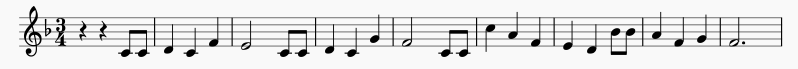

  *Except where otherwise noted, musical images in this document were created by importing tbon midi files directly into  MuseScore 2.1 without further editing.* 

  * Here's the chorus of Leonard Bernstein's *America* theme from West Side Story. I've shown it with numerical pitches just to illustrate how tbon supports those. More importantly, notice how easily tbon represents Bernstein's shifts between 6/8 and 3/4 time on alternate bars 


    ```
    K=C B=4.
    ^555 111  | 6-4 -1- | ^555 111  | 2-7 -5- |
    @777 @333 | 2-@7 -4- | @333 @666 | 5-^3 -/1- |
    ```
    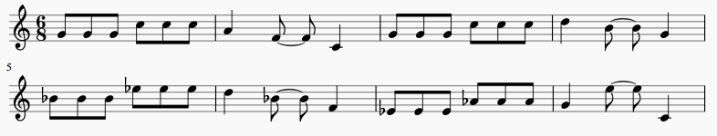


### The notation
  * __Beats__ are groups of pitches, rests and holds followed by whitespace. 
    * The measure below has two beats.
        ```
        ab-c de |
        ```
        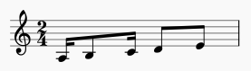
  * The __meter__ is determined by the number of beats between barlines ('|')
      * You may freely change meters by putting more or fewer beats within a bar.
         ```
         /* The first measure below has 4 beats, the second has 3. */
         a bc d ef | g - - |
         ```
        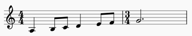
        
  * __Pitch names__ are represented by a b c d e f g (alternatively by 1 2 3 4 5 6 7).
  
  * __Hyphen__ `-` indicates continuation within and across beats (i.e. a tie).

  * __Rests__ are indicated by letter `z` or underscore `_`.
    * Notice that rests are also extended by hyphens
      ```
      cz - cz | -c - z |
      ```
      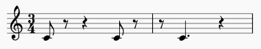
  
  
  * __Note durations__: tbon can represent *any* rhythm that can be represented in conventional music notation.
     ```
     a b c d | e f e d |
     ```
     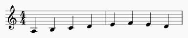
     
     ----
     ```
     a -b c d |
     ```
     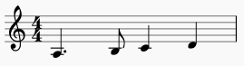
     
     ----
     ```
     ab c d - |
     ```
     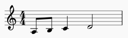
     
     ----
     ```
     a - b - | - - c - |
     ```
     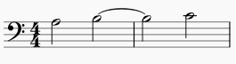
     
     ----
     ```
     abc c--d e f |
     ```
     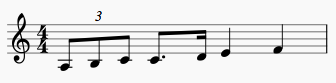
     
     ----
     
    * See also (examples/rhythms.tba)

  * __Accidentals__ : Sharps,flats and naturals are '#', '@' and '%' respectively.
      - Double sharp and double flat are `##` and `@@` respectively.
      - Accidentals come __before__ the pitch, i.e. `#f` not `f#`.
      - Accidentals persist until the end of the measure (standard music convention)
      - Unicode symbols are supported but most keyboard layouts don't include them in any convenient way.
        - Example: `c♭c 𝄫c♭c ♮c♯c 𝄪c♯c | c - - - |`
      
      
  * __Melody direction__: Pitches move up or down using the Lilypond relative pitch entry convention.
      * By default, the pitch of each note is placed above or below its predecessor based on which interval is smaller.
          * Thus, `c g` will put the g below the c since the 4th below is smaller than the 5th above.
          * To select the more distant upper pitch, you'd write `c ^g`
          * Similarly you'd write 'c /d' to put choose the d a 7th below the c.
          * The first pitch in a melody is relative to Middle C (midi #60). 
  
    

  * __Chords__
    * Pitches inside `( )` are sounded simultaneously and sustained.
    * Duration works the same as for individual notes.
    * Melody direction rules apply to pitches in the order specified as though the parentheses did not exist. This also applies to Rolls and Ornaments (see below).
    * Example 1
      ```
      /* God Save the Queen */
      /* (with jazz chords) */
      T=90
      (/3561)- (/3561) (/4@672)  | (/24@67) -(/6^351) (/4@672) | (/5613) (/5613) (/@6724) |
      (/5613) -(/4@672) (/6^351) | (/7^4@62) (/6^351) (/@6247) | (/6^351) - - |
      ```
      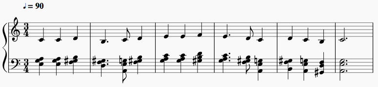
      *<small>Musescore spelled the A-flats in the vii°7 chords as G-sharps in the above example. I've left them as imported.</small>*

    * Example 2
      ```
      /* Oompah accompaniment in thirds */
      T=88 B=4.
      /c(^ce)(ce)  //g-(^ce)(bd)(ce)- /c(^ce)(ce)  //g-(^ce)(bd)(ce)-  |
      /c(^ce)(ce)  //g-(^ce)(bd)(ce)- t=0.9 //gab (c^gce) |
      ```
      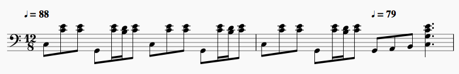
      
  * __Rolls__
    * Pitches inside `(: )` are attacked in sequence over the duration of 1 sub-beat and sustained afterwards in the same manner as chords.
  * __Ornaments__
    * Pitches inside `(~ )` are attacked in sequence over the  duration of 1 sub-beat. 
    * Each pitch save the last ends when its successor begins.
    * The last pitch may be sustained by hyphens following the ornament.
    * Example with rolls, chords and ornaments:
      ```
      /* Demonstrates chords,rolls and ornaments */
      T=120
      z - - (://1^1351) | - 2 (~3432)3 - | 3 4 (~5654)5 - |
      6 7 (~171717)6 (572)(~1767) | 15 35 (//1^1351) - |
      ```
      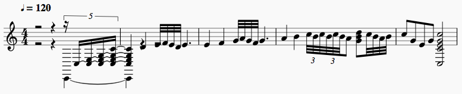
      
  * __Tempo__
    * Tbon supports two kinds of tempo markers, absolute and relative.
    * Either may appear anywhere except within a beat.
    * Absolute tempo is specified like this in beats per minute:  `T=100`
    * Relative tempo is specified like this: `t=0.9`
    * Relative tempo is a floating point value greater than 0.
    * Relative tempo represents a fraction (or multiple) of the most recent absolute tempo.
    * `T=100 a b t=0.9 c d | t=1.0 e f g a |` means "Play the first two notes at 100 bpm, the next two at 90 bpm and the remainder at 100 bpm.
    * Relative tempi are multiplied by the current absolute tempo and the result is rounded to the nearest integer.
  
  * __Key Signatures__
    * All common major and minor key signatures are recognized. Use lower case for minor, upper for major.
    * Example: `K=b` for B minor, `K=E@` for E-flat major.
    * Majors: `C G D A  E  B  C@ F# G@ C# D@ A@ E@ B@ F`
    * Minors: `a e b f# c# g# a@ d# e@ a# b@ f  c  g  d`
    * Placement: At the start of any measure before the first beat of the measure.
    * You may omit accidentals that are in the key when writing notation.
    * Numeric notation is interpreted so that `1` corresponds to the tonic of the most recent key signature.
      * In minor keys the 3rd, 6th, and 7th degrees are flatted.
      * Example: `K=f 12 34 56 71 |` produces the natural minor scale starting on F.
  
  * __Velocity (Loudness)__
    * Specify with `V=` anywhere between (but not within) beats.
    * Default is V=0.8 which corresponds to midi velocity 101 for all notes.
    * Allowed values are between 0.0 (silence) and 1.0 (maximum, midi 127).
    * Affects all following notes until changed.
    * See examples/echo.tbn for an example.
        ```
        /* Testing velocity changes. */
        V=0.8 12 34 5 - | V=0.5 /12 34 5 - |
        V=0.8 54 32 1 - | V=0.5 ^54 32 1 - |
        ```
  * __De-emphasis__
    * Syntax `D=N` where N is between 0.0 and 1.0 inclusive.
    * Default is D=0.0 (no de-emphasis, all notes equal velocity).
    * Velocities of notes that aren't on the downbeat are scaled by (1.0 - N).
    * Placement: At the start of any measure before the first beat of the measure.
    * Affects all following notes until changed.
    * See examples/emphasis.tba
    ```
        /* Illustrates effect of de-emphasis */

        /* None */
        K=C T=120 D=0.0
        c d e | f g a | b c d | c - - |

        /* Subtle */
        D=0.1
        /c d e | f g a | b c d | c - - |

        /* Quite noticeable */
        D=0.3
        /c d e | f g a | b c d | c - - |

        /* Almost certainly too much */
        D=0.5
        /c d e | f g a | b c d | c - - |
    ```
  * __Comments__
    * Tbon supports C-style comments that may span multiple lines.
    * Comments start with `/*` and end with `*/`
    * Placement: anywhere except inside a bar
      * `/* ok */ a b c d | /* ok, too. */ e f g a | /* and this is also ok. */`
      * `T=120 /* Error! */ a b c d | e /* Error! */ f g a |`
    * See examples/comments.tbn
    ```
     /* 
     This is a comment that
     spans three lines and that, 
     my friends, is perfectly fine. 
     */
     1 2 3 - | /* comment between bars */ 1 2 3 - |
     /* Coment at end of file */
    ```
  * __Beat Note__
    * Syntax: `B=N` where N is one of `2 4. 4 8`
      * `2` means half-note beat
      * `4.` means dotted quarter note beat (need for compound meters like 6/8)
      * `4` means quarter note beat
      * `8` means eighth-note beat
    * Not required to produce midi files with correct note durations.
    * Useful for generating correct time signatures in the midi output file.
      * Time signatures are produced by counting the number of beats in each bar in conjunction with the most recent beat note.
    * Example: See examples/meter.tba
      ```
      /* Changing meter and tempo. Constant quarter-note duration. */
      /* 4/4  */
      T=120
      B=4 c d e f |

      /* 6/8  */
      B=4. gag gag |

      /* 2/4  */
      B=4 c c |

      /* 6/8  */
      B=4. gag gag |

      /* 2/4 */
      B=4 c c |
      ```
      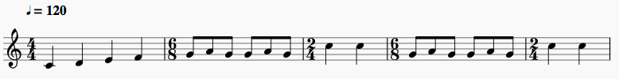
    * Changing the beat note does not change tempo.
      * The adjustment follows common practice in printed music, namely that changing meter numerator without an explicit tempo change retains the durations of printed notes before and after the change.  If you want a different tempo, you must explicitly change it.
      
## Command line
The top level executable is `tbon.py`. As I mentioned earlier it's useful to make a symbolic link to it somewhere in your path. For example, I did `ln -s ~/tbon.py ~/bin/tbon` so I can type `tbon` from any directory to process input files. Here's the help available by typing `tbon -h`.
```
Michaels-Mac-mini:tbon mellis$ tbon -h
usage: tbon [-h] [-x TRANSPOSE] [-b FIRSTBAR] filename [filename ...]

positional arguments:
  filename              one or more files of tbon notation

optional arguments:
  -h, --help            show this help message and exit
  -x TRANSPOSE, --transpose TRANSPOSE
                        Number of semitones to transpose up or down. The default
                        is 0.
  -b FIRSTBAR, --firstbar FIRSTBAR
                        The measure number of the first measure. (Used to align
                        beat map output)
 ```
   * Running, say, `tbon myfile.tba` will produce myfile.mid. 
   * Running `tbon -x 3 myfile.tba` will produce a myfile.mid transposed up 3 semitones.
### File extensions
  * Tbon uses the file extension to determine whether to expect numbers or letters as pitch names.
  * `.tba` indicates letters.
  * `.tbn` indicates numbers.
  * Any other extension is an error.
### Beat maps
  * Since tbon lets you change meters implicitly by the number of beats in each bar, some means of checking that you didn't add or omit unwanted beats is needed.
  * When tbon runs, it prints the entire input file followed by a beat map, like this:
  ```
   $ tbon examples/minorscale.tbn
   Processing examples/minorscale.tbn
   /* Melodic minor scale */
   /* Written first in C major, then in c minor */
   K=C 12 @34 56 71 | 1@7 @65 4@3 21 |
   K=c 12 34 5%6 %71 | 17 65 43 21 |

   Beat Map: Number of beats in each bar
   0:    4    4    4    4
   Created examples/minorscale.mid
  ```
  * If you are compiling a segment from a larger work, you can tell tbon the number of the first measure with the `-b` option, e.g. `tbon -b 13 examples/minorscale.tbn` and get a beat map aligned to the right measure numbers.
  ```
  Beat Map: Number of beats in each bar
  10:                   4    4    4    4
  ```
   

 

## Contributing
All suggestions and questions are welcome. I'd especially welcome help putting together a good setup.py to make it easy to put tbon on PyPi. As this is my first serious attempt at writing a parser, I'd also welcome suggestions for improving what I presently have (though it seems to be working rather well at the moment). See the issues section for more ideas.

## Oh, and one more thing ...
I'd love to be able to include clickable links to MIDI files for the examples but GitHub doesn't support linking to them in comments and README files. They tell me that hearing requests from more people would increase the chance they'll get around to adding MIDI files to the many filetypes they already support. So please send a note to support@github.com asking them to make it so. Thanks! 
          
