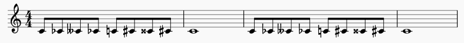
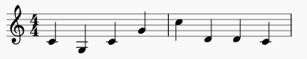
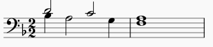
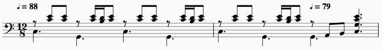
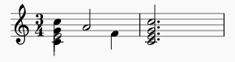
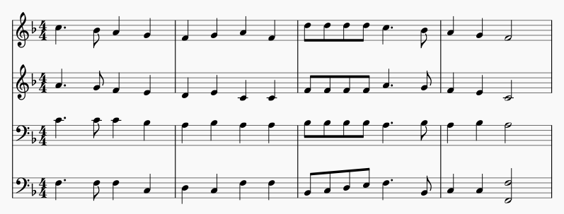
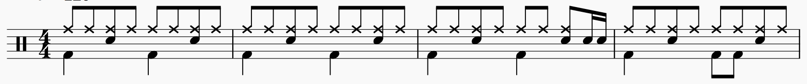

# tbon
Typographic Beat-Oriented Notation for music

__Tbon aims to be the fastest way to enter pitches, rhythms, meter and dynamic levels from a computer keyboard.__

Tbon is a musical language I developed for my own use about a decade ago.  It's a quick notation shorthand for writing melodies -- by hand or with a computer keyboard -- that also aims to be 'readable' in the sense that it's possible to play from it by sight.

Tbon borrows ideas from Lilypond, ABC, and music21's TinyNotation. What makes it different is that it's never necessary to explicity specify a note duration (e.g. 1/2, 1/4) or a meter (e.g. 4/4, 6/8, etc). Beats are groups of notes separated by whitespace.

Tbon produces MIDI files with tempo, key, and meter changes correctly specified. So far, I've verified that the files can be imported to:
  * MuseScore -- An excellent and very popular freeware notation editor. I used it for all the musical images in this document.
  * Reaper -- An inexpensive commercial DAW that runs on Windows and OS X
  * Logic Pro X -- Professional DAW from Apple. (OS X only)
  * QMidi - low-cost commercial player app.
  
Any DAW or notation program that correctly reads MIDI files should be able to import, play, and edit the files produced by Tbon. (Note: Garage Band does not support changes of meter in imported MIDI files. I don't recommend it.)

This repo is very much *alpha* software. That being said, the parser and evaluator are passing all tests and it's possible to write melodies and convert them to midi files quite easily. Moreover, I don't anticipate making any breaking changes to the language at this point (I've been tinkering with the design for ten years now so it feels pretty much final in terms of basic syntax and capabilities).

## Acknowledgments
  * Over the years I'm made several attempts to write a parser for Tbon using regexes but never found time to get it working properly. I recently came across Erik Rose's [Parsimonious](https://github.com/erikrose/parsimonious) Python PEG and had a working grammar within a couple of hours. I can't say enough good things about Parsimonious. 
  * Kudos also to Mark C. Wirt's [MIDIUtil](https://github.com/MarkCWirt/MIDIUtil). I use it in the tbon executable to convert tbon's output to midi files and it works "mahvellously."
  * [Pytest](https://docs.pytest.org/en) is far and away the best Python testing framework I've found. Introspecting assert statements and smart approximate comparisons are the bomb!

## Tbon's niche in the music software ecosytem
There are dozens of great (and not-so-great) [music software programs](https://en.wikipedia.org/wiki/List_of_music_software) available. I mentioned a few I use regularly in the  introduction at the top of this README. Some specialize in typesetting -- the creation of printed music notation -- while others, usually known as DAWs (Digital Audio Workstations), focus on editing and mixing recorded MIDI and audio.

Tbon is intended as a front-end for either category. Its strength is easy entry and editing of pitches, rhythms and dynamics with a simple and clean syntax that covers the broadest possible range of notatable music. Much of the simplicity comes from a design decision to favor quickly getting to output you can hear without worrying about what printed notes will represent the music.

Here are some ways I'm using Tbon.

**For learning music:** I sing baritone in several different choral groups. Some the works we perform are quite complex with time signatures that change every measure and frequent shifts of tonality.  Like many choristers, I'm musically knowledgable but I don't play piano accurately (at least not without a lot of practice on any given passage). I use Tbon to quickly create accurate midi files of parts I need to learn with proper tempi and dynamics. 

For my own use, midi playback is usually all that's needed. For files I share with others, I usually improve the sound by importing the midi files into a DAW (Reaper) and output an mp3 rendered through a sampled grand piano synth. Using a DAW also permits fine-scale editing for special articulations e.g *szforando, subito piano* etc. (For simplicity, Tbon ignores the possibility of tempo and dynamic changes at durations smaller than an entire beat.)

**For ear training:** In my experience, the most valuable ear training is learning to hear and write out the pitches and rhythms of real music. Tbon's numeric relative pitch option (1, 2, 3, ...  == do, re, mi ...) is expressly included for that purpose. For a good video discussion of the merits of relative pitch ear training, see [this video](https://vimeo.com/130824567) by music educator Julian Bradley.  

**For composition:** I first developed Tbon as a pencil-and-paper notation for quickly writing down melodic ideas anywhere on any available scrap of paper. It's still useful in that way.  In implementing it as a computer language, I've extended it to make it possible to write out music in multiple polyphonic parts. (Now if I can only manage to spend less time developing and documenting Tbon, I might actually find time to write some more music :-)

I'm not a music teacher so I can't say I'm using Tbon **for teaching music** but I do believe a musically inclined child could grasp the basics in a very short time.

## Live Demo
__You can try tbon without installing anything.__ There's a demo server that's running at (http://ellisgrant.pythonanywhere.com) but do skip down and skim the [Tutorial](#tutorial) section of this page beforehand. If you decide you'd like to run tbon on your own computer, see the [Local Installation](#local-installation) section of this README.

## Tutorial
Let's begin with a couple of familiar tunes that illustrate the majority of tbon's notation syntax.
  * Here's *Happy Birthday* in F major represented in tbon.

  ```
    K=F
    z - cc | d c f  | e - cc | d c ^g | f - cc |
    ^c a f | e d ^bb | a f g  | f - - |
  ```
  

  *<tiny>Except where otherwise noted, musical images in this document were created by importing tbon midi files directly into  MuseScore 2.1 without further editing.</tiny>*
  
  If you've used other text-based note entry systems, this should look somewhat familiar. You've probably guessed that the `K=F` in the first line tells tbon that the pitches should be interpreted as being in F major, i.e. that 'b' is flatted unless modified by an accidental.
  
  Now look at the first measure, `z - cc |`. You've just met the 4 most important symbols in tbon. 
  
  We use `z` for rests. By itself, the `z` indicates that the first beat is silent.
  
  The next symbol is a dash (`-`, keyboard 'minus'). Dashes extend the preceding note or rest. In this case it comes after a rest, meaning that beat two of this measure is alsosilent. (Note: It could have been written `z z` and produced the same music)
  
  Beat 3 of the first measure is `cc`. It represents a pair of 'c' notes, each lasting half the beat. That's a really important principle in tbon: *When notes or rests or dashes appear together without spaces between them, they divide one beat into equal parts.* So if the beat is a quarter-note, `cc` represents two eighth-notes.
  
  Similarly, `ccc` would be a triplet beat, `cccc` four sixteenths, `ccccc` a quintuplet and so on. Want to divide a beat into notes of different length? No problem, just use dashes. Here's a dotted-eighth + sixteenth division: `c--c`. The first 'c' gets 3/4 of the beat and the second one gets the remaining 1/4 of the beat.
  
  Ok, back to Happy Birthday.  As you might guess, measures are separated by barlines (the `|` symbol). When Tbon sees one of those, it counts the beats in the measure and inserts a time-signature at the beginning of the measure. Our first measure has 3 beats and Tbon assumes a quarter-note beat unless you indicate otherwise, so our first measure is in 3/4 time.
  
  If you look ahead you'll see that all the remaining measures also have 3 beats. Tbon won't insert unneeded time signatures in those measures.
  
  There's one more new symbol in measures 4, 6 and 7. It's an octave mark, `^`. Until the fourth measure, all the pitches in the melody have been within a musical 4th of the preceeding pitch. Now the melody needs to leap up by a 5th from `c` to `g`. Without the `^` octave mark, tbon would have pitched the `g` a 4th below the `c`.
  
  We'll meet the downward octave mark, `/`, in our next example melody.        
  * Here's the chorus of Leonard Bernstein's *America* theme from West Side Story.
    ```
    K=C B=4.
    /* I like to be in America ... */
    ^555 111  | 6-4 -1- | ^555 111  | 2-7 -5- |
    @777 @333 | 2-@7 -4- | @333 @666 | 5-^3 -/1- |
    ```
    

 The first line, `K=C B=4.` tells tbon that the key is C major and that the beat note, `B=4.` is a dotted quarter-note. This tune is in 6/8 time. Musicians call 6/8, 9/8, etc *compound meters*, meaning that the beat is a multiple of the duration given in the time signature's denominator.

  The second line, `/* I like to be in America ... */`, is a comment. It has no effect on the music tbon produces. (C programmers will recognize the syntax. For everyone else, just know that anything you enclose between `/*` and `*/` is a comment.)

  Let's look at the 1st measure, `^555 111 |`. The up octave mark is familiar, but what's with those numbers? They're tbon's other pitch format. The numbers are what musicians call *diatonic scale degrees*, which for our example is an overblown way of saying "1 is c, 2 is d, 3 is e, 4 is f, 5 is g, 6 is a, 7 is b." But it's really more than that because tbon takes the key signature into account when deciding which number matches which note name. If we changed `K=C` to `K=E`, 1 would be 'e', 2 #f, 3 #g, and so on.

  The very first note in our example, `^5`, is the fifth note of the C major scale, `g`. We need the octave mark because tbon assigns the pitch of the first note in a tune by assuming it was preceded by Middle C and we want the `g` in this melody to be the note above.

  Before moving on to measure 2, notice that there are 2 beats in measure 1 and each is divided in to 3 parts. Tbon will notice the 2 beats and the dotted-quarter beat note (`B=4.`) and insert a 6/8 time signature. 

  Now look at measure two, `6-4 -1- |`. Mr. Bernstein used a rhythmic pattern that's common in Latin American music,  *"3 against 2"*, by breaking the two beats of 6/8 into 3 notes of equal length as if the meter had changed from 6/8 to 3/4. (in fact we could have notated that second measure as `B=4  6 4 1 |` and tbon would have inserted the 3/4 signature.)

  Measure two shows how to handle triplets that span 2 beats. That happens frequently in music and it's worthwhile to see how it works. To split two beats into 3 parts, start by splitting each beat into 3 parts. Then give each note two of those parts so that the note in the middle spans from the end of the first beat into the start of the second. The same logic can be applied to more difficult cases, e.g, splitting 3 beats into a quintuplet: `1--2-  -3--4  --5--`.

  We've not yet encountered sharps, flats, and naturals (aka *accidentals*) so look at measure 4. The `@` before the 7 and the 3 means to flat them.  Tbon follows the conventions of printed music: Accidentals are put **before** the note and they persist for the remainder of the measure. So all the 7's and all the 3's in measure four are flatted.

  The symbols for sharp and natural are `#` and `%`.

  Lastly, as promised in first example, we see the down octave mark on the `c` in the last measure to force the leap down from the high 'e' above.

Here endeth the tutorial. The notation reference below contains the fine print and more illustrations of the concepts we've just covered plus some other considerations that include [tempo](#absolute-tempo), [volume](#velocity-loudness), [downbeat emphasis](#de-emphasis) and [MIDI Channel](#channel). The extended notation section explains how to write [chords](#chords) and [multiple voices](#multiple-voices). (tbon is quite capable of representing an entire symphony score).

## Notation Reference
### Basic notation
#### Beats 
are groups of pitches, rests and holds followed by whitespace. 
  * The measure below has two beats.
      ```
      ab-c de |
      ```
      
#### Meter
is determined by the number of beats between barlines ('|')
  * You may freely change meters by putting more or fewer beats within a bar.
    ```
    /* The first measure below has 4 beats, the second has 3. */
    a bc d ef | g - - |
    ```
    
  * You may use a colon, `:`, instead of `|` for barlines. The colon is easier to type from many smartphone keyboards.
    ```
    /* Above example with colons as barlines */
    a bc d ef : g - - :
    ```

#### Pitch names
are represented by `a b c d e f g`. 
  * Tbon also supports movable pitches `1 2 3 4 5 6 7`.
    * `1` corresponds to the tonic of the current key. 

#### Hyphen  `-`
indicates continuation within and across beats (i.e. a tie).

#### Rests
are indicated by letter `z` or underscore `_`.

  * Notice that rests are also extended by hyphens
    ```
    cz - cz | -c - z |
    ```
    


#### Note durations 
tbon can represent *any* rhythm that can be represented in conventional music notation.
  * A few examples
     ```
     a b c d | e f e d |
     ```
     

     ----
     ```
     a -b c d |
     ```
     

     ----
     ```
     ab c d - |
     ```
     

     ----
     ```
     a - b - | - - c - |
     ```
     

     ----
     ```
     abc c--d e f |
     ```
     

     ----

    * See also (examples/rhythms.tba)

#### Accidentals
Sharps,flats and naturals are '#', '@' and '%' respectively.
  * Double sharp and double flat are `##` and `@@` respectively.
  * Accidentals come __before__ the pitch, i.e. `#f` not `f#`.
  * Accidentals persist until the end of the measure (standard music convention)
  * You may also use Unicode music symbols to improve readability.
    * Unfortunately most keyboard layouts don't include them in any convenient way.
    * Some mobile browsers may not render them correctly.
    * Example:

      ```
      /* Unicode accidental support. */
      c♭c 𝄫c♭c ♮c♯c 𝄪c♯c | c - - - |
      /* is the same as */
      c@c @@c@c %c#c ##c#c | c - - - |
      ```
      


#### Octave marks

Pitches move up or down using the Lilypond relative pitch entry convention.

  * By default, the pitch of each note is placed above or below its predecessor based on which interval is smaller.
    * Thus, `c g` will put the g below the c since the 4th below is smaller than the 5th above.
    * To select the more distant upper pitch, you'd write `c ^g`
    * Similarly you'd write `c /d` to put choose the d a 7th below the c.
    * Use multiple octave marks to move by more than 1 octave, e.g. `\\c` or `^^c` to move down or up by 2 octaves.
    * The first pitch in a melody is relative to Middle C (midi #60). 
    * Example:
      ```
      c g c ^g | c /d d c |
      ```
      

#### Beat Note

  * Syntax: `B=N` where N is one of
    * `2.` = dotted half-note beat
    * `2` = half-note beat
    * `4.` = dotted quarter note beat
    * `4` = quarter note beat
    * `8.` = dotted eighth-note beat
    * `8` = eighth-note beat
    * Used to generate correct time signatures in the midi output file.
    * Time signatures are produced by counting the number of beats in each bar in conjunction with the most recent beat note.
    * Example: See examples/meter.tba
      ```
      /* Changing meter. Constant quarter-note duration. */
      /* 4/4  */
      T=120
      B=4 c d e f |

      /* 6/8  */
      B=4. gag gag |

      /* 2/4  */
      B=4 c c |

      /* 6/8  */
      B=4. gag gag |

      /* 2/4 */
      B=4 c c |
      ```

      

    * Changing the beat note does not change tempo.
      * The adjustment follows common practice in printed music, namely that changing meter numerator without an explicit tempo change retains the durations of printed notes before and after the change.  If you want a different tempo, you must explicitly change it.

### Extended Notation
  Using only the notation above, you can quickly write any single voice melody no matter how complex the rhythm. That's quite a lot for only a handful of symbols. The resultant midi file will have a C-major key signature, the tempo will be fixed at 120 bpm, and the midi file will interpret the beat duration as quarter notes. To move beyond those restrictions, continue reading.


#### Chords

  * Pitches inside `( )` are sounded simultaneously and sustained.
  * Duration works the same as for individual notes.
  * Melody direction rules apply to pitches in the order specified as though the parentheses did not exist. This also applies to Rolls and Ornaments (see below).
    * Example 1
      ```
      /* God Save the Queen */
      /* (with jazz chords) */
      T=90
      (/3561)- (/3561) (/4@672)  | (/24@67) -(/6^351) (/4@672) | (/5613) (/5613) (/@6724) |
      (/5613) -(/4@672) (/6^351) | (/7^4@62) (/6^351) (/@6247) | (/6^351) - - |
      ```
      
      *<small>Musescore spelled the A-flats in the vii°7 chords as G-sharps in the above example. I've left them as imported.</small>*

    * Example 2
      ```
      /* Oompah accompaniment in thirds */
      T=88 B=4.
      /c(^ce)(ce)  //g-(^ce)(bd)(ce)- /c(^ce)(ce)  //g-(^ce)(bd)(ce)-  |
      /c(^ce)(ce)  //g-(^ce)(bd)(ce)- t=0.9 //gab (c^gce) |
      ```
      

#### Polyphony

In the chord examples above, all the notes in each chord end when the next chord or note begins. But sometimes, we want to sustain notes into the the next chord.  In tbon, this is accomplished with the 'hold' symbol '-'.  Within a chord, the hold symbol means 'sustain the corresponding note from the previous chord'.

  * Example 1
    ```
    /* Two voices with suspensions */
    K=F B=2
    (db)(-a) (c-)(-g) | (fa) - |
    ```
    

  By adding holds in the 'oompah' example from the preceding section, we can make the bass notes continuous, like so:
  * Example 2
    ```
    T=88 B=4.
    /c(-^ce)(-ce)  //g-(-^ce)(-bd)(-ce)- /c(-^ce)(-ce)  //g-(-^ce)(-bd)(-ce)-  |
    /c(-^ce)(-ce)  //g-(-^ce)(-bd)(-ce)- t=0.9 //g(-a)(-b) (c^gce) |
    ```
    

  You may use rests within chords to stop one or more voices while sustaining others. 
  * Example 3
    ```
    (cegc) (z-az) (-f--) | (cegc) - - |
    ```
    

#### Rolls
  * Pitches inside `(: )` are attacked in sequence over the duration of 1 sub-beat and sustained afterwards in the same manner as chords.

#### Ornaments
  * Pitches inside `(~ )` are attacked in sequence over the  duration of 1 sub-beat. 
  * Each pitch save the last ends when its successor begins.
  * The last pitch may be sustained by hyphens following the ornament.
  * Example with rolls, chords and ornaments:
    ```
    /* Demonstrates chords,rolls and ornaments */
    T=120
    z - - (://1^1351) | - 2 (~3432)3 - | 3 4 (~5654)5 - |
    6 7 (~171717)6 (572)(~1767) | 15 35 (//1^1351) - |
    ```
    
#### Multiple Voices

    Use the *partswitch*, `P=n` to write music in multiple parts.

  * Example:
    ```
    /* Last 4 bars of Deck The Hall (SATB)  */
    P=1 K=F  ^c -b a g | f g a f |  ^dd dd c  -b  | a t=0.8 g t=0.5 f   - |
    P=2 K=F  ^a -g f e | d e c c |   ff ff a  -g  | f       e       c   - |
    P=3 K=F   c -c c b | a b a a |   bb bb a  -b  | a       b       a   - |
    P=4 K=F  /f -f f c | d c f f |  /bc de f -/b  | c       c    (/f^f) - |
    ```
    

  * You may use as many voices as needed.
  * The voices must have contiguous numbers starting at 1.
  * Voice 1 is special. Tempo changes must be given there. Tempo changes in other voices are ignored.
  * The following must be supplied per voice:
    * Key Signature
    * Beat Note
    * Velocity
    * De-emphasis
  * You may interleave part segments in different lines as you wish, or write each voice out in it's entirety.
  * All voices start at time 0. If you want a voice to be silent at the beginning, you must supply measures of rest.
  * Divisi are supported within voices. See the last bar of the bass line in the example and the Polyphony section, above.

#### Tempo
  * Tbon supports two kinds of tempo markers, absolute and relative.
  * Either may appear anywhere except within a beat.
  * Absolute tempo is specified like this in beats per minute:  `T=100`
  * Relative tempo is specified like this: `t=0.9`
  * Relative tempo is a floating point value greater than 0.
  * Relative tempo represents a fraction (or multiple) of the most recent absolute tempo.
  * `T=100 a b t=0.9 c d | t=1.0 e f g a |` means "Play the first two notes at 100 bpm, the next two at 90 bpm and the remainder at 100 bpm.
  * Relative tempi are multiplied by the current absolute tempo and the result is rounded to the nearest integer.

#### Key Signatures
  * All common major and minor key signatures are recognized. Use lower case for minor, upper for major.
  * Example: `K=b` for B minor, `K=E@` for E-flat major.
  * Majors: `C G D A  E  B  C@ F# G@ C# D@ A@ E@ B@ F`
  * Minors: `a e b f# c# g# a@ d# e@ a# b@ f  c  g  d`
  * Placement: At the start of any measure before the first beat of the measure.
  * You may omit accidentals that are in the key when writing notation.
  * Numeric notation is interpreted so that `1` corresponds to the tonic of the most recent key signature.
    * In minor keys the 3rd, 6th, and 7th degrees are flatted.
    * Example: `K=f 12 34 56 71 |` produces the natural minor scale starting on F.

#### Velocity (Loudness)
  * Specify with `V=` anywhere between (but not within) beats.
  * Default is V=0.8 which corresponds to midi velocity 101 for all notes.
  * Allowed values are between 0.0 (silence) and 1.0 (maximum, midi 127).
  * Affects all following notes until changed.
  * See examples/echo.tbn for an example.
      ```
      /* Testing velocity changes. */
      V=0.8 12 34 5 - | V=0.5 /12 34 5 - |
      V=0.8 54 32 1 - | V=0.5 ^54 32 1 - |
        ```
#### De-emphasis
  controls the amount of emphasis given to the downbeat. It's specified as the amount of de-emphasis applied to the other beats in the measure to make the math cleaner.
  * Syntax `D=N` where N is between 0.0 and 1.0 inclusive.
  * Default is `D=0.0` (no de-emphasis, all notes equal velocity).
  * Velocities of notes that aren't on the downbeat are scaled by (1.0 - N).
  * Placement: At the start of any measure before the first beat of the measure.
  * Affects all following notes until changed.
  * See examples/emphasis.tba
      ```
      /* Illustrates effect of de-emphasis */

      /* None */
      K=C T=120 D=0.0
      c d e | f g a | b c d | c - - |

      /* Subtle */
      D=0.1
      /c d e | f g a | b c d | c - - |

      /* Quite noticeable */
      D=0.3
      /c d e | f g a | b c d | c - - |

      /* Almost certainly too much */
      D=0.5
      /c d e | f g a | b c d | c - - |
      ```
#### Channel

By default, tbon assigns MIDI channel number 1 to all notes in all parts.  You can explicitly assign different channel numbers.

  * Syntax: `C=N`
  * Valid values for N are 1 thru 16, inclusive.
  * Different parts may have different channel numbers.
#### Percussion
  * To write percussion, use `C=10` and follow the General MIDI Percussion Keymap.
    * See [Percussion Keymap](http://computermusicresource.com/GM.Percussion.KeyMap.html)
    * Tbon doesn't do anything special for percussion. It relies on your synthesizer to apply the standard interpretation to note events on channel 10.
  * Example:
    ```
    /* Bass drum, snare, ride pattern */

    /* Bass drum GM #36, snare #38, ride #51 */
    D=0.2
    C=10 (//1^@3)3 (/2^3)3 (/1^3)3  (/2^3)3 |

    (/1^@3)3  (/2^3)3 (/1^3)3  (/2^3)3  |

    (/1^@3)3  (/2^3)3 (/1^3)3  (/2^3)-/22  |

    (1^@3)3   (/2^3)3 (/1^3)(/1^3) (/2^3)3  |
    ```
    
#### Comments
  * Tbon supports C-style comments that may span multiple lines.
  * Comments start with `/*` and end with `*/`
  * Placement: anywhere except inside a beat.
    * `/* ok */ a b /* ok, too. */ c d | /* ok, too. */ e f g a | /* and this is also ok. */`
  * See examples/comments.tbn
  ```
   /* 
   This is a comment that
   spans three lines and that, 
   my friends, is perfectly fine. 
   */
   1 2 3 - | /* comment between bars */ 1 2 3 - |
   /* Coment at end of file */
  ```

## Local Installation
There's no installer at present so if you want to run tbon on your own computer, you'll need to clone this repository or copy the files. Installing tbon locally provides some advantages over the Live Demo site. You can
  * use your favorite text editor,
  * choose your own midi player,
  * create tbon files of unlimited length.

## Dependencies
  * The code was written with Python 3.5. I haven't tested with 2.x. 
  * The parser requires Parsimonious (pip install parsimonious).
  * The test suite needs to be run with PyTest (pip install pytest).
  * To create a midi file, you'll need MIDIUtil (pip install MIDIUtil)

## Quick Start
Begin by building the examples. Assuming you've cloned into `~/tbon` do the following:
```
cd ~/tbon
./tbon.py examples/*.tb*
```
Tbon will process the notation source files in the examples directory and create MIDI files you can play or import into your favorite notation editor or DAW.

You can create your own input files with a text editor using the syntax described below. I suggest making a symbolic link from somewhere in your path to `~/tbon.py` so you can save your work outside the repo.

To dive deeper, look at `parser.py` and `test_parser.py`.


## Command line
The top level executable is `tbon.py`. As I mentioned earlier it's useful to make a symbolic link to it somewhere in your path. For example, I did `ln -s ~/tbon.py ~/bin/tbon` so I can type `tbon` from any directory to process input files. Here's the help available by typing `tbon -h`.
```
$ tbon -h
usage: tbon [-h] [-b FIRSTBAR] [-q] [-v]
            filename [filename ...]

positional arguments:
  filename              one or more files of tbon notation

optional arguments:
  -h, --help            show this help message and exit
  -b FIRSTBAR, --firstbar FIRSTBAR
                        The measure number of the first measure. (Used to
                        align beat map output)
  -q, --quiet           Don't print the input file and bar map to stdout.
  -v, --verbose         dump the MidiEvaluator output to stdout

 ```
   * Running, say, `tbon myfile.tba` will produce three output files:
     * myfile.mid
     * myfile_with_metronome.mid
     * myfile_metronome_only.mid

     The first contains just the music you entered. The second has a separate metronome track that follows your tempo and metter changes. You may find this quite useful for learning transcribed music. The metronome only file has just the metronome and can be useful for testing how well you play or sing a piece without accompaniment.

### File extensions
  * Tbon uses the file extension to determine whether to expect numbers or letters as pitch names.
  * `.tba` indicates letters.
  * `.tbn` indicates numbers.
  * Any other extension is an error.
### Beat maps
  * Since tbon lets you change meters implicitly by the number of beats in each bar, some means of checking that you didn't add or omit unwanted beats is needed.
  * When tbon runs, it prints the entire input file followed by a beat map, like this:
  ```
   $ tbon examples/minorscale.tbn
   Processing examples/minorscale.tbn
   /* Melodic minor scale */
   /* Written first in C major, then in c minor */
   K=C 12 @34 56 71 | 1@7 @65 4@3 21 |
   K=c 12 34 5%6 %71 | 17 65 43 21 |

   Beat Map: Number of beats in each bar
   0:    4    4    4    4
   Created examples/minorscale.mid
  ```
  * If you are compiling a segment from a larger work, you can tell tbon the number of the first measure with the `-b` option, e.g. `tbon -b 13 examples/minorscale.tbn` and get a beat map aligned to the right measure numbers.
  ```
  Beat Map: Number of beats in each bar
  10:                   4    4    4    4
  ```

## Contributing
All suggestions and questions are welcome. I'd especially welcome help putting together a good setup.py to make it easy to put tbon on PyPi. As this is my first serious attempt at writing a parser, I'd also welcome suggestions for improving what I presently have (though it seems to be working rather well at the moment). See the issues section for more ideas.

## Oh, and one more thing ...
I'd love to be able to include clickable links to MIDI files for the examples but GitHub doesn't support linking to them in comments and README files. They tell me that hearing requests from more people would increase the chance they'll get around to adding MIDI files to the many filetypes they already support. So please send a note to support@github.com asking them to make it so. Thanks! 

